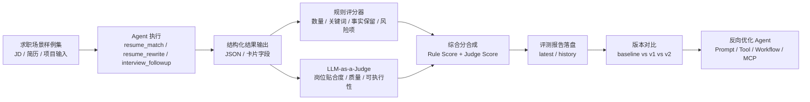
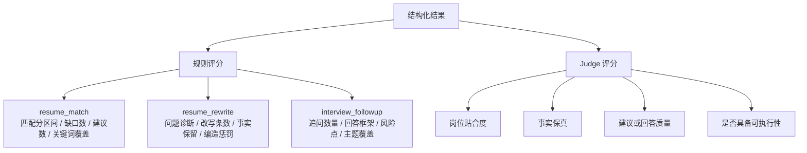
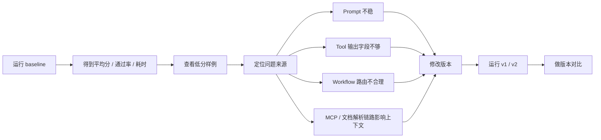

# Agent Eval 面试讲述流程图

这份文档不是给模型看的，而是给你面试时讲项目链路用的。

建议你讲的时候，不要上来就说“我做了个评测系统”，而是按下面这条链路说：

1. 先定义场景样例和成功标准
2. 再让 Agent 跑出结构化结果
3. 用规则评分看“有没有达标”
4. 用 LLM Judge 看“质量够不够好”
5. 合成综合分并沉淀成版本报告
6. 用版本对比驱动 Prompt / Tool / Workflow 迭代

## 一张适合面试讲的总流程图

## 我在面试里会怎么讲

你可以直接按下面这版口径说：

> 这个项目里我没有把 Eval 只做成一个单纯的“模型打分器”，而是拆成了两层。第一层是规则评分，主要检查结构化输出是否满足任务要求，比如匹配分析有没有识别出缺口、简历改写有没有保留原始事实、面试追问有没有给到回答框架。第二层是 LLM-as-a-Judge，补充判断结果是否真的更贴岗位、更可信、更可执行。最后我把规则分和 Judge 分按权重合成综合分，并把每次跑出来的结果沉淀成版本化报告，用来比较不同 Prompt 和 Tool 版本的效果变化。

## 展开讲的第二张图：规则分和 Judge 分分别在看什么

## 第三张图：为什么这套 Eval 能指导迭代

## 面试时最有用的 3 句话

- 我把 Agent Eval 拆成了“规则评分 + LLM Judge”两层，兼顾稳定性和语义质量判断。
- 我不是只看单次输出，而是把评测结果版本化沉淀成 `latest / history / compare` 报告，用来比较不同 Prompt 和 Tool 版本的效果变化。
- 这套 Eval 的作用不是做展示，而是反向驱动 Agent 的 Prompt、Tool 输出协议和 Workflow 编排迭代。

## 如果面试官继续追问

### 为什么不只用 LLM Judge？

因为纯 Judge 波动更大，也更难解释。规则评分可以先把“结构完整性、数量达标、事实保留”这类硬约束稳定住，Judge 再补充“结果是否真的更好”。

### 为什么不只用规则评分？

因为规则评分只能判断“像不像”，不一定能判断“好不好”。比如两份改写结果都包含关键词，但其中一份可能明显更自然、更贴岗位，这部分更适合由 Judge 补充评价。

### 这套 Eval 最终产出了什么？

最终产出了三类可量化结果：

- 样例级：每条 case 的规则分、Judge 分、综合分
- Tool 级：每个 Tool 的平均分、通过率、平均耗时
- 版本级：不同版本之间的平均分、通过率和耗时变化
